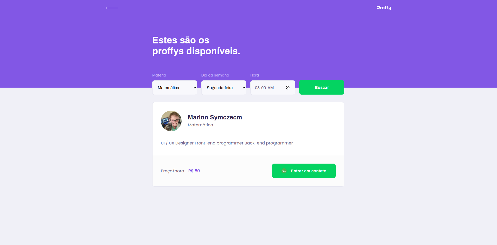
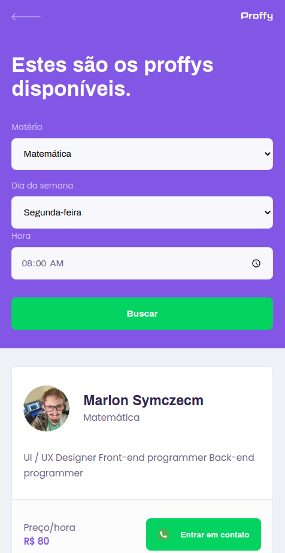
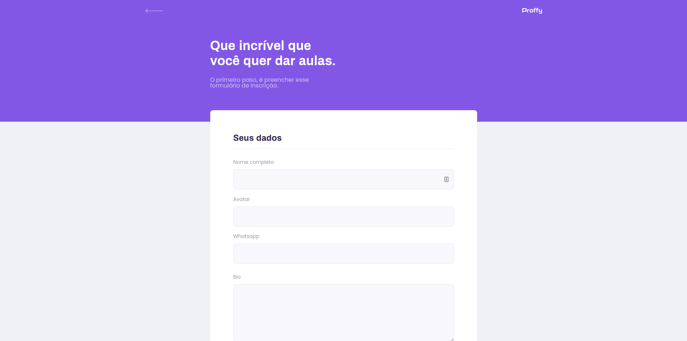
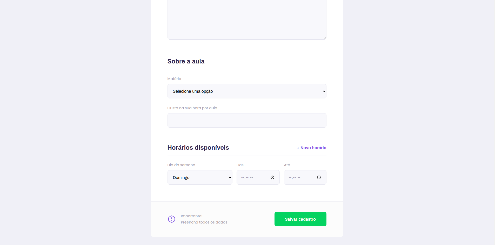
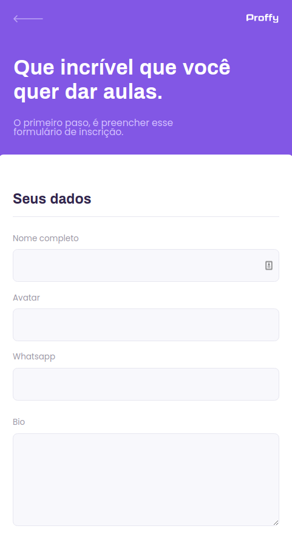
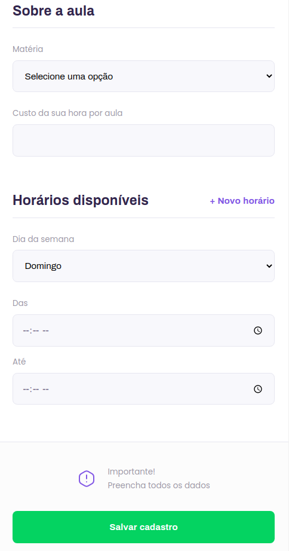

# Next Level Week #2 - Rocketseat - PROFFY - WEB

Projeto que está sendo desenvolvido na segunda Next Level Week produzido pela Rocketseat, e tendo como instrutor o Diego Fernandes.

# Projeto

O projeto que está sendo desenvolvido é uma plataforma online para que possa ter uma interatividade entre professores e alunos, podendo assim o aluno contratar um professor particular para matéria que necessitar.

O projeto está sendo feito em 3 etapas:
- Primeira etapa a criação da api
- Segunda etapa o aplicativo web já responsivo e com a conexão com banco de dados
- Terceira etapa o aplicativo mobile desenvolvido em React Native

O projeto contem a primeira tela que á landing, possuindo a logo, descrição do que tem nela, dois botões fantásticos, um sendo para listagem dos professores para conseguir uma conexão com algum deles, e o outro botão é para o professor que quiser dar aulas, clicar nele e se inscrever na plataforma, contando um pouco de si com sua biografia, avatar, nome completo, matérias e horários que vai atender.
Na página principal ainda possuí uma amostragem de quantas conexões já foram realizadas também.
Essa página pode ser vista na capa aqui do README.

Agora será mostrado o layout da tela quando se clica no botão estudar:

Esse é o layout de como ficou na web, na versão quando o usuário acessa de um smartphone, ele ficou da seguinte forma:

Como o layout foi pensado no mobile first, para desktop foi mais simples de se fazer, deixando só o essencial, não poluindo o layout, para que não haja erros no entendimento do usuário quando for usá-lo.

Agora será mostrado abaixo o layout da tela quando se clica no botão Dar aulas, que é onde o usuário se increverá para dar aulas na paltaforma Proffy:

A imagem a cima possui os primeiros campos, só os principais campos, para que não encha o usuário com coisas desnecessárias.

Na imagem a cima possui os últimos campos com o usuário podendo adicionar vários horários e dias para dar aulas.

Esse é o layout de como ficou na web, na versão quando o usuário acessa de um smartphone, ele ficou da seguinte forma:

Como mencionado a cima a programação desse projeto foi começada pelo mobile, fazendo assim a aplicação ficar consistente entre o desktop e a versão reduzida, deixando ela além de responsiva, também coesa.

# Stack

A stack que está sendo utilizado é toda baseada em JS, está sendo feito o projeto em ReactJS no front-end.

# Funcionalidades

Agora será listado as funcionalidades que o aplicativo web tem até o momento:

- Listagem de professores disponíveis
- Listagem das conexões já feitas com os professores
- Listagem por hora e matéria de professores
- Cadastro de novos professores com suas matérias, hora de atendimento, e também o custo por hora|

# Autor

Agradeço por ter acompanhdo o projeto, e bora voar juntos nessa stack que só cresce.

Aluno: **Marlon Symczecym**
Instrutor: **Diego Fernandes**
